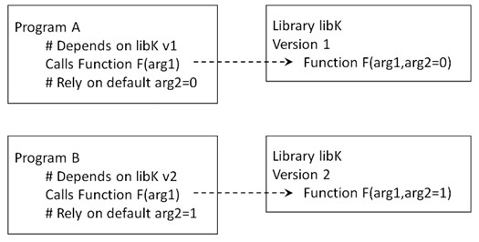

# The Module System

The module system (lmod) provides an easy method for switching between
different versions of software packages or programs. It also means that
different software packages which have conflicting dependencies, or the same
software but with different versions, can be made available to users. The user
chooses the software that they want to use, and which version. The module
system then sets up all paths and shell variables ready for the software to be
run.

## Managing Dependencies

Some software comes complete with any dependencies which it might have.
However, most software relies on other software (or libraries) being available
on the system on which it is installed. As well as requiring that the library
itself is available, there is often a dependence on specific versions of the
library. For example, as depicted in the figure below, program A might use
function F from version 1 of library libK and use the default for arg2.
However, a new version of libK has changed the default for arg2 from 0 to 1.
Meanwhile, new program B has been written to depend on the new default for
arg2. Which version of libK should be installed? It may be easy to have both
installed in different locations. However, for the two programs, A and B, to
see the correct version of libK various environment variables would need to
point to the right locations. If the user only needs to use program A or
program B then it would be fairly straightforward to set the environment
variables on login and leave them to only ever point to the required version.
In contrast, if the user needs to use both programs then the environment
variables would need to be changed back and forth according to which program
was required at any given time.



Modules, or more correctly, environment modules, provide a convenient way for
the user to dynamically change their environment through scripts called
modulefiles. These scripts are invoked by either loading or unloading the
required module, as described below. The environment changes which are then
made include adding or removing directories to various environment variables,
including the search path `PATH` and others such as `LD_LIBRARY_PATH` and
`MANPATH`. The updated variables then allow the user to easily run the version
of software which they have requested access to, and enable the software to
find the versions of dependencies which it needs. The ability to unload a
module and then load a different module allows the user to switch easily
between versions of software which might otherwise be incompatible.

## Available Software

Most popular software can be made available to the module system.
Considerations for whether or not software is installed as a module are given
in the following subsections.

### EasyBuild EasyConfig Scripts

Although not essential for installing software modules, one popular method for
managing modules is the EasyBuild system which comes with a large number of
pre-configured EasyConfig scripts. The current version comes with over 11,000
scripts for over 2,200 different software packages, or bundles of packages! For
the system administrator, these turn the task of installing a software package
into one of picking the correct script to pass to the EasyBuild program.
Details on how to manage the installation of modules are given in the Admin
guide on Deploying Software Modules.

Although numerous, the pre-configured scripts which come with the EasyBuild
system do not (and cannot) cover all available software or all possible
software versions. If software is required for which no EasyConfig script is
currently readily available then a script will need to be written. This may be
a relatively trivial task if the new script can be based upon an existing
script. Or it may require considerable effort, for example, if there are many
dependencies involved or if the available documentation for the software is not
very helpful.

### Software Bundles

Some software naturally gets grouped together. The two main examples, described
in more detail below, are 'R' and 'Python' both of which rely on third
party packages or extensions for most of their functionality. More importantly
for the installation of software modules, however, are various core development
bundles. These group together compatible versions of compilers and core
libraries which are frequently used together when building other software.
Module versions may, therefore, include reference to 'GCC' or 'GCCcore' for
different versions of the [gcc tool chain](https://gcc.gnu.org/), or 'foss' for
bundles of 'free and open source software' built, in turn, upon GCC.

### R

For R, we intend to always have the latest version installed at all points
alongside many older versions (for script compatability sake).

Please note that it is extremely important not to include `install` commands
within analysis scripts. It is bad practice for any analysis script to
re-install or update previously installed packages. Installing or updating
packages should be up to the user to manage as a conscious move. If a package
author changes any part of the behaviour of their package, either intentionally
or inadvertently, this could break the script. Or worse, it could silently
change the analysis being performed and the user would not necessarily know
that the change had happened. Further, if the user goes back to previous
results they may never know which version of a package was actually used for
that analysis as the package may have been updated since those results were
obtained. This leads to irreproducible research rather than reproducible
research.

#### Packages

On many systems, R packages are usually installed in bulk and stored at either
a user level (in your home repository) or at a site/system level (alongside the
binary). This is generally fine on a small scale, but when factoring in
multiple users, all of their projects and the different version requirements,
this becomes completely unruly. Package management in R is much less known
about in comparison to a language like python, javascript or rust, but it does
exist. We use the package [renv](https://pkgs.rstudio.com/renv/) to manage
packages for each project a user might work on. renv is built similarly to
package managers one might use in web development or python. That is to say, it
keeps a record of the packages required for a project in an isolated, portable
and reproducible manner. 

renv will automatically come with all R versions provided and a separate guide
can be found [here](https://pkgs.rstudio.com/renv/articles/renv.html). renv
is by no means enforced on the system, but it is highly encouraged. By using
renv:

- Package installations will in general be easier and faster
- Less space will be used thanks to caching
- Dependency hell is much easier to avoid

### Python

There are currently several modules for the core Python software, each for
different versions of Python. Some of these versions are requirements for other
software packages. A series of nested Python bundles are available. This nesting
is due to dependencies on other Python packages or modules. For example, the
scikit-learn module depends on the SciPy-bundle. The SciPy-bundle, in turn,
depends on numpy, scipy and pandas, amongst others.

#### Conda

Although several Python bundles have been built as described above, users with
specific requirements for Python should install their own version by installing
some conda distribution (recommended are
[miniconda](https://www.anaconda.com/docs/getting-started/miniconda/main) and
[miniforge](https://github.com/conda-forge/miniforge)). This includes a minimal
version of Python plus the conda package manager. Once installed it uses around
4-500MB of disk space. This is preferred to a full Anaconda installation which
uses around 3GB and installs thousands of additional packages, many of which
are probably not required.

## Accessing Software

Software modules are made available to the user using the `module` command. In
general, all library and program dependencies which are required are made
available at the same time. However, there are exceptions to this. Note that
the version of a module only needs to be specified if there is more than one
version available, and the version required is not the one set as default.
Also, TAB-completion can be used to complete available options and to see what
options are available.

A complete guide to the `module` command is beyond the scope of this guide.
However, a few examples are now given to cover basic usage. In general, the
command takes a sub-command to tell it what basic function is requested. The
choice of sub-command then determines which other arguments are optional or
required. Some of the output has been truncated for brevity.

### List Available Modules

A full list of available modules is obtained using the `avail` sub-command.
The output contains both the main programs which users would want to run, and
the libraries and other programs upon which those programs depend. As such, the
output is automatically sent through the `more` command to view a screen at a
time:

```
$ module avail

------------- /software/easybuild/modules/all -------------

Autoconf/2.69-GCCcore-9.3.0

Autoconf/2.69-GCCcore-10.2.0 (D)

Autotools/20180311-GCCcore-9.3.0

Autotools/20200321-GCCcore-10.2.0 (D)

BCFtools/1.10.2-GCC-9.3.0

--More--
```

Here the `(D)` indicates which version is the default when more than one
version is available for a given module. The sort order of the module names is
case sensitive A-Z followed by a-z (I know, I looked and I don't see a way of
changing this). In contrast, the sort order of versions for a given module is
case insensitive with version numbers interpreted as numbers (3.9 listed before
3.10). The 'avail' subcommand will also take patterns to match, and these are
not case sensitive:

```
$ module avail R

------------- /software/easybuild/modules/all -------------

Autoconf/2.69-GCCcore-9.3.0

Autoconf/2.69-GCCcore-10.2.0 (D)

Autotools/20180311-GCCcore-9.3.0

Autotools/20200321-GCCcore-10.2.0 (D)

Bio-DB-HTS/3.01-GCC-8.2.0-2.31.1-Perl-5.28.1

--More--
```

If a regular expression is needed, for example, to only match a pattern at the
beginning of the module name, then this can be specified using the '-r' flag,
however, the search is then case sensitive:

```
$ module -r avail "^r"

---------------- /software/easybuild/modules/all ----------------

re2c/1.2.1-GCCcore-8.3.0 re2c/1.3-GCCcore-9.3.0 (D)

Where:

...

$ module -r avail "^R"

---------------- /software/easybuild/modules/all ----------------

R-bundle-Packages/3.6.3-20210317-foss-2020a (3.6.3)

R-bundle-Packages/4.0.3-20210317-foss-2020a (D:4.0.3)

R/3.6.3-foss-2020a

R/4.0.3-foss-2020a (D)

RStudio/1.4.1102

Where:

...
```

Note that, as well as the `(D)` to indicate the default version, the output
also indicates any aliases, for example `(3.6.3)` for the first R bundle.
Although superfluous here, once more versions of the bundle modules are built,
this allows a short cut to a specific version.

Another option is to pipe the output through `grep` or `egrep` (see the [Linux
guide](./basic_linux.md). However, the output from `module avail` is sent to
standard error, not the more usual standard output, so redirection is also
required. The following redirection and pipe will allow this list to be
filtered:

```
$ module avail 2>&1 | grep " R"

R-bundle-Packages/3.6.3-20210317-foss-2020a (3.6.3)

R-bundle-Packages/4.0.3-20210317-foss-2020a (D:4.0.3)

R/3.6.3-foss-2020a

R/4.0.3-foss-2020a (D)
```

Note that `module avail` puts spaces before the module names in the output
so, instead of using the caret `^` to pin the pattern to the beginning of
the line, a space is used here.

One final option is to use `module spider`. The `spider` subcommand returns all
modules across all hierarchal levels (whilst `avail` purely reports on modules
which can be loaded directly), the syntax is equivalent to `module avail` when
searching (regular expressions also allowed). The `spider` subcommand will
also report the description of the modules found (which are taken from the 
module's installation script).

### Load Modules

To load a module it is sufficient to use the sub-command `load` together with
the module name. If no version is specified then the default version is loaded:

```
$ module load R

$ module list

Currently Loaded Modules:

1) GCCcore/9.3.0 

...

26) fontconfig/2.13.92-GCCcore-9.3.0 

27) xorg-macros/1.19.2-GCCcore-9.3.0

...

53) R/4.0.3-foss-2020a
```

As can be seen, libraries and other dependencies are also loaded. Since all
dependencies are required in order for the software to work, this may be the
only indication of dependencies for a given module without examining the
EasyBuild scripts which have been used to install the module and its
dependencies.

Instead of loading just core R, a suitable bundle can be loaded complete with R
packages. The core R module does not need to be loaded separately as it's given
as a dependency for the R bundle. In this example, all loaded modules are first
unloaded using the `purge` sub-command, as given in the 
[Unload section](#unload-loaded-modules) below. Also, TAB completion (as for
bash) is used to complete the full name of the module. For clarity here, the
command line is repeated on a separate line after each <TAB> along with any
further text which is typed; in practice the command line itself would remain
on a single line:

```
$ module purge

$ module load R-b<TAB>

$ module load R-bundle-Packages<TAB><TAB>

R-bundle-Packages

R-bundle-Packages/3.6.3

R-bundle-Packages/3.6.3-20210317-foss-2020a

R-bundle-Packages/4.0.3

R-bundle-Packages/4.0.3-20210317-foss-2020a

$ module load R-bundle-Packages/3<TAB>

$ module load R-bundle-Packages/3.6.3
```

Note that this list includes any aliases, though it does not indicate which
versions those point to.

The output from `module list` is very similar to before for the core R
module, though now for version 3.6.3 and with just four extra modules,
including the R-bundle-Packages module:

```
$ module list

Currently Loaded Modules:

1) GCCcore/9.3.0 

...

24) ncurses/6.2-GCCcore-9.3.0 

...

53) R/3.6.3-foss-2020a
```

So although the version requested in the `module load` command was the alias
`3.6.3`, it can be seen that the the version loaded was that pointed to by
the alias.

### List Loaded Modules

The sub-command `list` was used in the examples above to list all loaded
modules. As for the sub-command `avail`, this list can be filtered by giving
a further argument:

```
$ module list "k"

Currently Loaded Modules Matching: k

1) ScaLAPACK/2.1.0-gompi-2020a 
2) Tk/8.6.10-GCCcore-9.3.0
3) R-bundle-Packages/3.6.3-20210317-foss-2020a

```

Giving the `-r` option makes the match case sensitive:

```
$ module -r list "k"

Currently Loaded Modules Matching: k

1) Tk/8.6.10-GCCcore-9.3.0 
2) R-bundle-Packages/3.6.3-20210317-foss-2020a$
```

### Unload Loaded Modules

Assuming that the following gives the list of modules currently loaded:

```
$ module list

Currently Loaded Modules:

1) GCCcore/9.3.0

...

24) ncurses/6.2-GCCcore-9.3.0 53) R/3.6.3-foss-2020a

...

57) R-bundle-Packages/3.6.3-20210317-foss-2020a
```

Individual modules can be unloaded using the 'unload' sub-command:

```
$ module unload ncurses

$ module list

Currently Loaded Modules:

1) GCCcore/9.3.0 30) lz4/1.9.2-GCCcore-9.3.0

...

24) X11/20200222-GCCcore-9.3.0 57)

...

56) R-bundle-Packages/3.6.3-20210317-foss-2020a
```

Alternatively, all modules can be unloaded in one go using the `purge`
sub-command:

```
$ module purge

$ module list

No modules loaded
```

Instead of unloading a module and then loading a new module with a different
version, it is also possible to use `swap`. In this case, the currently
loaded module is given followed by the required module and version. Again TAB
completion can be used to help complete the names:

```
$ module swap R-b<TAB>

$ module swap R-bundle-Packages/3.6.3-20210317-foss-2020a R-b<TAB>

$ module swap R-bundle-Packages/3.6.3-20210317-foss-2020a
R-bundle-Packages<TAB><TAB>

R-bundle-Packages

R-bundle-Packages/4.0.3

R-bundle-Packages/4.0.3-20210317-foss-2020a

$ module swap R-bundle-Packages/3.6.3-20210317-foss-2020a
R-bundle-Packages/4<TAB>

$ module swap R-bundle-Packages/3.6.3-20210317-foss-2020a
R-bundle-Packages/4.0.3

The following have been reloaded with a version change:

1) R-bundle-Packages/3.6.3-20210317-foss-2020a =>
R-bundle-Packages/4.0.3-20210317-foss-2020a

2) R/3.6.3-foss-2020a => R/4.0.3-foss-2020a
```


Note that aswell as the module swap requested, the command will also load, or
swap, any dependencies which are required by the new version. Here it can be
seen that the core R module was also swapped from version 3.6.3 to 4.0.3.
